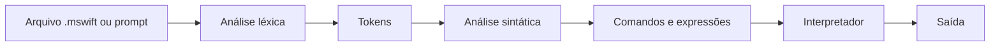
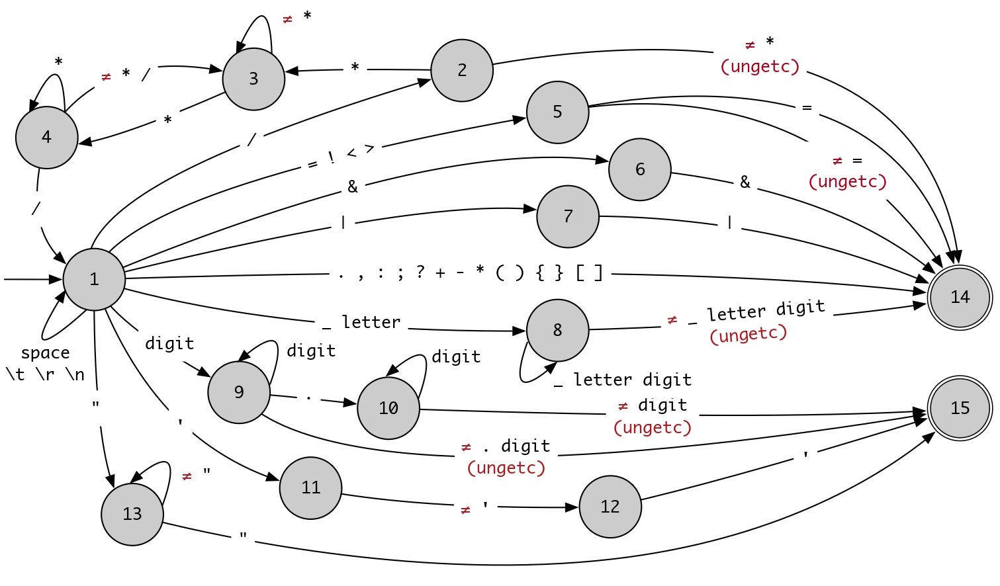

# MiniSwift

MiniSwift é um interpretador educacional escrito em Java para uma linguagem de
programação inspirada em [Swift](https://www.swift.org/). O projeto implementa
análise léxica, análise sintática, controle de tipos e execução de programas,
sem bibliotecas externas.

A linguagem usa tipos explícitos, escopo léxico e não possui `nil`. Ela oferece
variáveis e constantes, estruturas de controle, coleções, conversões e funções
básicas.

## Funcionalidades

- tipos primitivos: `Bool`, `Int`, `Float`, `Char` e `String`;
- tipos compostos: `Array<T>` e `Dict<K,V>`;
- declarações com `var` e `let`;
- comandos `if`, `else`, `while` e `for`;
- entrada e saída com `read`, `print`, `println` e `dump`;
- operadores aritméticos, relacionais, lógicos, unários e ternário;
- conversões explícitas entre tipos;
- execução de arquivos `.mswift` e modo interativo;
- mensagens de erro com o número da linha.

## Requisitos

- JDK instalado, com `java` e `javac` disponíveis no `PATH`;
- terminal compatível com Bash para executar os comandos abaixo.

O projeto foi compilado e testado com OpenJDK 25.0.4.

Verifique a instalação:

```bash
java --version
javac --version
```

## Instalação e compilação

```bash
git clone https://github.com/zulisses/MiniSwift.git
cd MiniSwift
javac -classpath . $(find . -type f -name '*.java')
```

Os arquivos `.class` são gerados ao lado dos respectivos arquivos `.java`.

## Execução

Para executar um programa salvo em arquivo:

```bash
java msi programa.mswift
```

Um exemplo já incluído nos casos de teste pode ser executado assim:

```bash
java msi cases/case11-exe.mswift
```

Para iniciar o modo interativo:

```bash
java msi
```

Exemplo de sessão:

```text
> let numero : Int = 10
> println(numero * 2)
20
```

Cada linha digitada no modo interativo é analisada e executada separadamente.
Use `Ctrl+D` para encerrar. Para programas com blocos em várias linhas, use o
modo de arquivo.

## Exemplo de programa

Salve o código abaixo como `soma.mswift`:

```swift
let valores : Array<Int> = Array<Int>(1, 2, 3)
var total : Int = 0

for let valor : Int in valores {
    total = total + valor
}

println(total)
```

Execute com:

```bash
java msi soma.mswift
```

Saída esperada:

```text
6
```

## Testes

O diretório `cases/` contém 15 casos de teste:

| Casos | Área verificada |
| --- | --- |
| 01–03 | análise léxica |
| 04–06 | análise sintática |
| 07–10 | regras semânticas e tipos |
| 11–15 | execução de programas |

Depois de compilar o projeto, execute a suíte:

```bash
bash cases/exec.sh . java msi
```

O script mostra o código, a saída esperada e a saída obtida. Ele pausa após
cada caso; pressione `Enter` para continuar. Os resultados são gravados como
`result01.out` até `result15.out` na raiz do projeto.

## Arquitetura



| Caminho | Responsabilidade |
| --- | --- |
| `msi.java` | ponto de entrada, modo de arquivo e prompt interativo |
| `lexical/` | tokenização e autômato do analisador léxico |
| `syntatic/` | parser descendente recursivo e construção dos comandos |
| `interpreter/command/` | execução das estruturas e dos comandos |
| `interpreter/expr/` | avaliação de expressões, operadores e acessos |
| `interpreter/type/` | representação dos tipos da linguagem |
| `interpreter/value/` | representação dos valores em tempo de execução |
| `error/` | erros internos e erros da linguagem |
| `cases/` | programas, entradas e saídas usadas nos testes |

## Referência da linguagem

### Declarações e escopo

Uma variável criada com `var` pode ser inicializada depois da declaração. Uma
constante criada com `let` precisa receber um valor na própria declaração e não
pode ser reatribuída.

```swift
var contador : Int
contador = 1

let limite : Int = 10
```

Os nomes possuem escopo léxico. Não é permitido declarar o mesmo nome duas
vezes no mesmo escopo, usar uma variável antes da declaração ou ler uma
variável ainda não inicializada.

### Tipos

| Tipo | Exemplo | Descrição |
| --- | --- | --- |
| `Bool` | `true` | valor lógico |
| `Int` | `42` | número inteiro |
| `Float` | `3.14` | número de ponto flutuante |
| `Char` | `'a'` | um caractere |
| `String` | `"texto"` | sequência de caracteres |
| `Array<T>` | `Array<Int>(1, 2)` | lista de valores de um único tipo |
| `Dict<K,V>` | `Dict<String,Int>("um": 1)` | pares de chave e valor tipados |

Tipos primitivos são copiados por valor. Arrays e dicionários compartilham a
coleção subjacente quando atribuídos a outra variável. Não existem conversões
implícitas: os operandos de uma operação devem ter tipos compatíveis.

Strings e arrays usam índices `Int` iniciados em zero. Dicionários usam chaves
do tipo declarado. Um acesso fora dos limites ou a uma chave inexistente gera
um erro de execução. A atribuição por índice permite alterar uma `String`, um
`Array` ou um `Dict` armazenado em uma variável.

```swift
var letras : String = "casa"
letras[0] = 'm'

var notas : Dict<String,Int> = Dict<String,Int>()
notas["Ana"] = 10
```

### Comandos

| Recurso | Sintaxe básica |
| --- | --- |
| bloco | `{ ... }` |
| saída | `print(expr)`, `println(expr)` |
| depuração | `dump(expr)` |
| condicional | `if condição comando else comando` |
| repetição | `while condição comando` |
| iteração | `for nome in coleção comando` |
| atribuição | `destino = expressão` |

O `for` percorre caracteres de uma `String` ou elementos de um `Array`.
Comentários usam a forma `/* ... */` e podem ocupar várias linhas. O ponto e
vírgula no final dos comandos é opcional.

### Operadores

| Categoria | Operadores | Tipos aceitos |
| --- | --- | --- |
| aritméticos | `+`, `-`, `*`, `/` | `Int` e `Float` |
| concatenação | `+` | `String`, `Array` e `Dict` |
| caractere | `+` | `Char` |
| igualdade | `==`, `!=` | operandos do mesmo tipo |
| comparação | `<`, `>`, `<=`, `>=` | `Int`, `Float`, `Char` e `String` |
| lógicos | `&&`, `||`, `!` | `Bool` |
| sinal | `-` | `Int` e `Float` |
| ternário | `condição ? valor1 : valor2` | condição `Bool` |

As comparações entre strings usam o comprimento das strings. A soma de dois
dicionários combina seus pares; quando uma chave aparece nos dois operandos, o
valor do dicionário da direita prevalece.

### Ações, conversões e funções

| Recurso | Retorno ou efeito |
| --- | --- |
| `read()` | lê uma linha e retorna `String` |
| `random()` | retorna um `Float` aleatório no intervalo `[0, 1)` |
| `toBool(valor)` | converte o valor para `Bool` |
| `toInt(valor)` | converte `Char`, `Int` ou `Float`; retorna `0` nos demais casos |
| `toFloat(valor)` | converte `Char`, `Int` ou `Float`; retorna `0.0` nos demais casos |
| `toChar(valor)` | converte `Int` ou `Char`; retorna `\0` nos demais casos |
| `toString(valor)` | retorna a representação textual do valor |
| `.count()` | quantidade de caracteres de uma `String` ou elementos de um `Array` |
| `.empty()` | informa se uma `String`, um `Array` ou um `Dict` está vazio |
| `.keys()` | retorna as chaves de um `Dict` em um `Array` |
| `.values()` | retorna os valores de um `Dict` em um `Array` |
| `.append(valor)` | adiciona um elemento a um `Array` e retorna o próprio array |
| `.contains(valor)` | informa se um `Array` contém o valor |

As funções podem ser encadeadas quando o retorno aceita a chamada seguinte:

```swift
var numeros : Array<Int> = Array<Int>()
numeros.append(1).append(2)
println(numeros.count())
```

## Gramática

A gramática abaixo usa a notação EBNF. Chaves indicam repetição e colchetes
indicam uma parte opcional.

```ebnf
<code>      ::= { <cmd> }
<cmd>       ::= <block> | <decl> | <print> | <dump> | <if> | <while> | <for> | <assign>
<block>     ::= '{' <code> '}'
<decl>      ::= <var> | <let>
<var>       ::= 'var' <name> ':' <type> [ '=' <expr> ]
                { ',' <name> ':' <type> [ '=' <expr> ] } [ ';' ]
<let>       ::= 'let' <name> ':' <type> '=' <expr>
                { ',' <name> ':' <type> '=' <expr> } [ ';' ]
<print>     ::= ( 'print' | 'println' ) '(' <expr> ')' [ ';' ]
<dump>      ::= 'dump' '(' <expr> ')' [ ';' ]
<if>        ::= 'if' <expr> <cmd> [ 'else' <cmd> ]
<while>     ::= 'while' <expr> <cmd>
<for>       ::= 'for' ( <name> | ( 'var' | 'let' ) <name> ':' <type> )
                'in' <expr> <cmd>
<assign>    ::= <expr> [ '=' <expr> ] [ ';' ]

<type>      ::= <primitive> | <composed>
<primitive> ::= 'Bool' | 'Int' | 'Float' | 'Char' | 'String'
<composed>  ::= <arraytype> | <dicttype>
<arraytype> ::= 'Array' '<' <type> '>'
<dicttype>  ::= 'Dict' '<' <type> ',' <type> '>'

<expr>      ::= <cond> [ '?' <expr> ':' <expr> ]
<cond>      ::= <rel> { ( '&&' | '||' ) <rel> }
<rel>       ::= <arith> [ ( '<' | '>' | '<=' | '>=' | '==' | '!=' ) <arith> ]
<arith>     ::= <term> { ( '+' | '-' ) <term> }
<term>      ::= <prefix> { ( '*' | '/' ) <prefix> }
<prefix>    ::= [ '!' | '-' ] <factor>
<factor>    ::= ( '(' <expr> ')' | <rvalue> ) <function>
<rvalue>    ::= <const> | <action> | <cast> | <array> | <dict> | <lvalue>
<const>     ::= <bool> | <int> | <float> | <char> | <string>
<bool>      ::= 'false' | 'true'
<action>    ::= ( 'read' | 'random' ) '(' ')'
<cast>      ::= ( 'toBool' | 'toInt' | 'toFloat' | 'toChar' | 'toString' )
                '(' <expr> ')'
<array>     ::= <arraytype> '(' [ <expr> { ',' <expr> } ] ')'
<dict>      ::= <dicttype> '('
                [ <expr> ':' <expr> { ',' <expr> ':' <expr> } ] ')'
<lvalue>    ::= <name> { '[' <expr> ']' }
<function>  ::= { '.' ( <fnoargs> | <fonearg> ) }
<fnoargs>   ::= ( 'count' | 'empty' | 'keys' | 'values' ) '(' ')'
<fonearg>   ::= ( 'append' | 'contains' ) '(' <expr> ')'
```

## Analisador léxico

O analisador léxico usa um autômato finito determinístico para reconhecer os
tokens da linguagem.

<p align="center">
  
</p>

## Tratamento de erros

Erros da linguagem interrompem a execução e informam a linha com dois dígitos:

```text
03: Lexema não esperado [;]
```

| Categoria | Mensagens possíveis |
| --- | --- |
| léxica | `Lexema inválido [lexema]`, `Fim de arquivo inesperado` |
| sintática | `Lexema não esperado [lexema]`, `Fim de arquivo inesperado` |
| semântica/execução | variável não declarada, já declarada ou não inicializada; atribuição em constante; tipo inválido; operação inválida |

## Limitações conhecidas

- O prompt processa uma linha física por vez; blocos distribuídos em várias
  linhas devem ser executados por arquivo.
- A linguagem não possui funções definidas pelo usuário, classes, módulos ou
  gerenciamento de pacotes.
